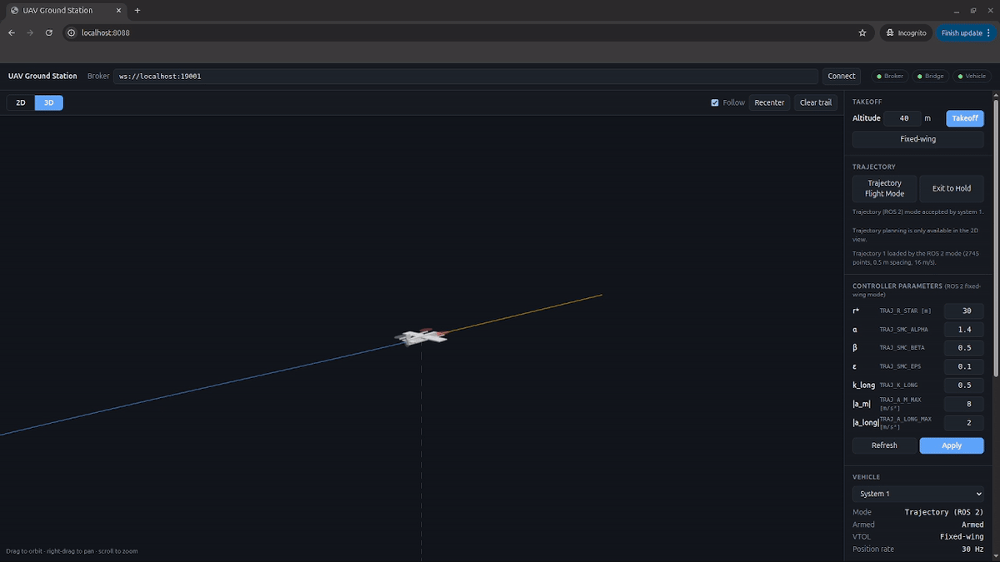
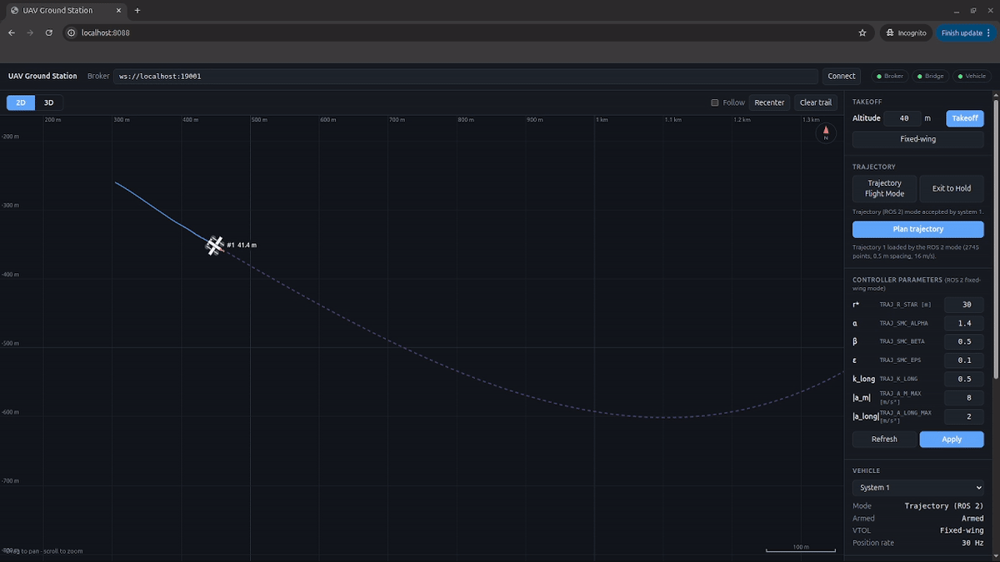
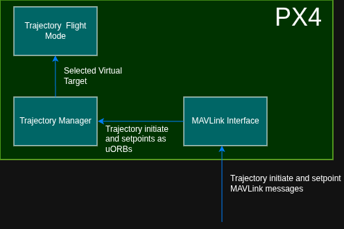
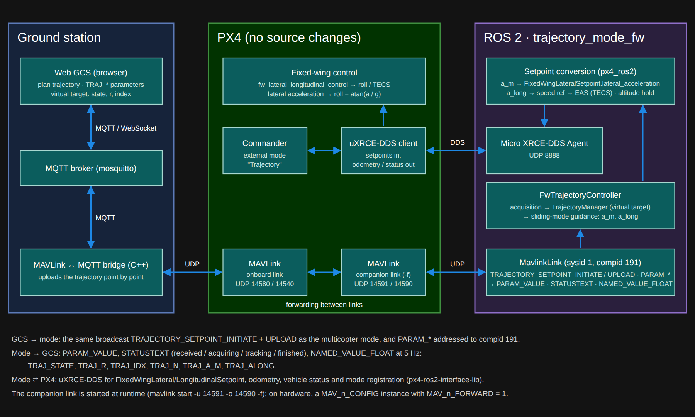

Trajectory controller based on the approach presented in [Chen et al. (2019)](https://doi.org/10.1016/j.ast.2019.02.034) with the assumption that the virtual target is not moving independent of the UAV. 





The implementation uses a terminal non-singular sliding mode controller with lateral acceleration as the output. 

PX4 flight mode is created for quadcopters since fixed wing versions do not accept acceleration setpoints. A MAVLink library is created to send waypoints. It starts by initiating the trajectory with the message TRAJECTORY_SETPOINT_INITIATE which specifies how many waypoints the trajectory contains and TRAJECTORY_SETPOINT_UPLOAD is used to send each waypoit.

Each waypoint contains: 
- index
- x in NED
- y in NED
- vx in NED
- vy in NED
- magnitude of laeral acceleration
- magnitude of jerk
- timestamp 

The architecture:
Trajectory manager is a PX4 module running with the trajectory flight mode to receive incoming trajectory setpoints and determine the virtual target point based on the position of the UAV. This is implemented as a separate module to reduce the load on the flight mode itself which performs tasks related to the sliding mode controller.



## Fixed-wing (VTOL) architecture

PX4's fixed-wing controllers do not accept acceleration setpoints, so for a VTOL in fixed-wing flight the same guidance runs outside PX4, as a ROS 2 external flight mode named **Trajectory** (`ros2/src/trajectory_mode_fw`). It needs **no PX4 source changes**. It talks MAVLink with the ground station like the internal multicopter mode, and uXRCE-DDS with PX4.



**Components**
- **Ground station:** the web GCS and the C++ MAVLink↔MQTT bridge, unchanged from the multicopter setup. The bridge uploads the trajectory point by point, 5 ms apart.
- **PX4:** only runtime configuration. A second MAVLink link with forwarding (`mavlink start -u 14591 -o 14590 -f`, started by `run_sim.sh --vtol`) passes the ground station's messages to the mode and back. PX4 never forwards a message back to the link it came from, and the bridge already uses the SITL onboard link. On hardware, this link would be a `MAV_n_CONFIG` instance for the companion computer with `MAV_n_FORWARD = 1`.
- **ROS 2 node `trajectory_mode_fw`:** a MAVLink component (sysid 1, compid 191) and a px4-ros2-interface-lib mode. The Micro XRCE-DDS Agent runs in the same container.

**Data flow**
1. **Trajectory:** the same broadcast `TRAJECTORY_SETPOINT_INITIATE` + `TRAJECTORY_SETPOINT_UPLOAD` as for the multicopter reaches the node through PX4's forwarding. Once every index has arrived, the node sends the STATUSTEXT `Trajectory <id> received (<n> points)`.
2. **Parameters:** `TRAJ_*` (same names as the PX4 parameters) through the MAVLink parameter protocol, addressed to compid 191. Changes are saved to `ros2/src/trajectory_mode_fw/config/params.yaml`.
3. **Guidance, every cycle (`FwTrajectoryController`):**
   - **Acquisition:** fly to a lead-in point behind the target point, then along the path direction into it. This continues until the vehicle is within r\* and flying along the path. A fixed-wing cannot slow down to reach the point the way a multicopter does.
   - **Tracking:** the unchanged `TrajectoryManager` virtual-target selection and sliding-mode law of the internal mode, giving `a_m` and `a_long`. If the target is lost for 3 s, it acquires the current point again.
   - **Finished:** at the end of the path it holds its course.
4. **Setpoints (uXRCE-DDS):**
   - `a_m` → `FixedWingLateralSetpoint.lateral_acceleration` (PX4 commands roll = atan(a/g));
   - `a_long` → a speed reference → equivalent airspeed for TECS;
   - altitude is held at its value on activation.
5. **Feedback to the GCS:** STATUSTEXT (acquiring / tracking / finished) and `NAMED_VALUE_FLOAT` at 5 Hz: `TRAJ_STATE`, `TRAJ_R`, `TRAJ_IDX`, `TRAJ_N`, `TRAJ_A_M`, `TRAJ_ALONG`. The web GCS shows them in its **Virtual target** block, and QGC's MAVLink Inspector shows them too.

The mode registers with PX4 once the VTOL is in fixed-wing flight, because PX4 only accepts fixed-wing setpoints then. For a VTOL, the web GCS's **Plan trajectory** selects this mode instead of the internal one. Details: [ros2/README.md](ros2/README.md).


## Setting up
Build the PX4 docker container and inside the container:
docker compose -f docker-compose-px4.yaml up -d --build
docker exec -it px4_gazebo_container bash


Run PX4 on Gazebo x500 SITL. Perform a takeoff and set the flight mode to Trajectory and send the waypoints.

To watch the UAV's position live in 2D or 3D, run the web ground station. It connects to PX4 through a C++ MAVLink↔MQTT bridge. See [ground_station/README.md](ground_station/README.md).

For a VTOL in fixed-wing flight, the same guidance runs as a ROS 2 external mode, with no PX4 changes. See [ros2/README.md](ros2/README.md).

## Quick start: SITL + ground station in one command

```bash
./run_sim.sh                # multicopter (Gazebo x500, headless) + web GCS
./run_sim.sh --vtol         # standard VTOL (Gazebo, headless) + web GCS + ROS 2 fixed-wing Trajectory mode
./run_sim.sh --vtol --sih   # the same with PX4's lightweight built-in simulator instead of Gazebo
./run_sim.sh stop           # stop PX4 SITL, the GCS and (if running) the ROS 2 mode; containers are kept
```

Everything runs **detached**: the containers with `docker compose up -d`, and PX4 SITL as a daemon in the background. The script returns once PX4 reports ready for takeoff and prints the web GCS address (`http://localhost:<WEB_PORT>`, 8080 or the port set in `.env`). While it runs:

```bash
./run_sim.sh logs                     # follow PX4's output
./run_sim.sh px4 commander status     # any PX4 shell command (commander, listener, param, ...)
```

Gazebo runs headless by default; add `--gui` to see its window. `--build` rebuilds the images after code changes.

## References

Chen, Q., Wang, X., Yang, J., & Wang, Z. (2019). Trajectory-following guidance based on a virtual target and an angle constraint. Aerospace Science and Technology, 87, 448–458. https://doi.org/10.1016/j.ast.2019.02.034
